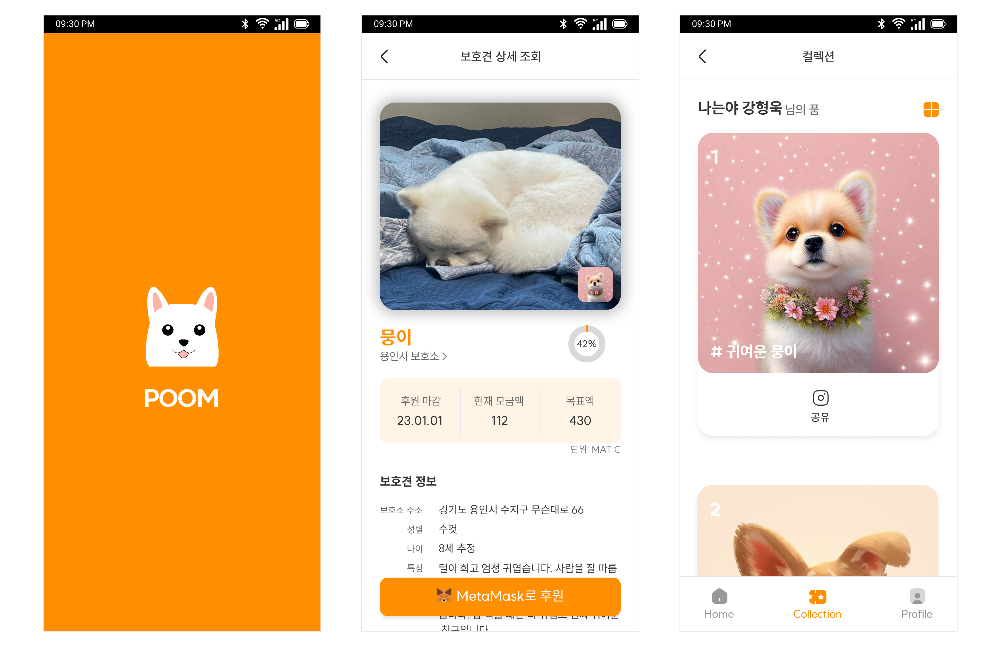

# POOM - 유기견 후원 및 NFT 발급 서비스

## 📅 프로젝트 기간

2023년 04월 10일 월요일 - 2023년 05월 19일 금요일 (총 기간 : 6주)

 

## 🌟 프로젝트 개요

1. **Summary(프로젝트 소개 및 요약)**
    - 많은 유기견을 보호 및 관리하는 보호소를 위한 새로운 후원 방식을 제안합니다.
    - NFT기반의 유기견 후원을 통한 후원 참여 및 관심 유도를 목표로 합니다.
    - 또한, 후원 랭킹 기능을 통해 후원자별 보호견의 NFT를 제공합니다.
    
2. **Planning Background(프로젝트 기획 배경)**
    - 유기견 보호 단체는 매년 많은 유기동물을 구조하고 돌보는 과정에 자금 부족에 시달리고 있습니다.
    - 이를 위해 다양한 후원 형태의 서비스를 운영하고 있지만, 홍보와 참여율이 저조하다는 문제가 있습니다.
    - POOM 서비스를 통해 새로운 후원 방식을 제안하고, 이를 통해 기존의 문제점을 개선하고자 합니다.
    - 또한, 블록체인 기술을 도입하여 후원의 투명성과 신뢰성을 보장합니다.
    
3. **Problem(기존 시스템의 문제점)**
    - 보호소나 단체를 대신하여 후원금을 전달하는 중개 역할이 부재할 경우 적절하게 사용되지 않을 수 있습니다.
    - 또한, 후원자들에게 유기견과의 직접적인 상호작용의 기회를 제공하지 않아 만족도를 낮추고 장기적인 관심과 지속적인 기부를 유도하는데 어려움이 있습니다.
    
4. **Performance(시스템 성과 및 기대효과)**
    - 후원자만의 NFT를 생성 및 발급하여 제공함으로 참여율을 높일 수 있습니다.
    - 후원을 통해 소유한 NFT를 SNS 공유를 통한 홍보 효과를 높일 수 있습니다.
    - 블록체인 기반의 후원 서비스를 통한 후원 내역의 투명성과 신뢰성을 보장할 수 있습니다.

 

## ✨ 프로젝트 핵심 기능

1. 보호견 후원 및 후원 관리 
    - 일반 회원과 보호소 회원 두 가지 유형으로 서비스를 이용할 수 있습니다.
    - 일반 회원과 보호소 회원 모두 보호견에게 후원할 수 있습니다.

1. 보호견 등록 및 보호견 관리
    - 보호소 회원인 경우, 현재 보호 중인 보호견을 등록할 수 있습니다.
    - 대표 사진 등록을 통해 보호견의 카툰 이미지를 생성할 수 있습니다.
    - 보호견의 사진, 이름, 성별, 특징 등을 입력하여 해당 보호견의 후원을 신청할 수 있습니다.
    - 나의 프로필에서 후원 중인 보호견 목록과 현황을 확인할 수 있습니다.

1. NFT 발급 및 조회
    - 진행이 완료된 후원 공고에 대한 NFT를 발급 할 수 있습니다.
    - NFT는 후원 공고의 랭킹 순위 결과를 바탕으로 램덤하게 발급됩니다.
    - 발급한 NFT는 NFT 컬렉션에서 확인할 수 있습니다.
    - 또한, 개인 컬렉션 페이지인 경우 발급받은 NFT를 SNS에 공유할 수 있습니다.
    - 다른 사용자의 컬렉션 페이지에서 다양한 NFT를 조회할 수 있습니다.

 

## 🧑🏻‍💻 팀원 및 담당 역할

💄 **프론트엔드 담당**  

송현주 - 프로필 및 NFT 컬렉션 개발, 후원 기능 개발, UI/UX 디자인 시안 설계  
안태현 - 메인 페이지 및 후원 상세 페이지 개발, 소셜 로그인 개발, UI/UX 디자인 시안 설계

⭐️ **백엔드 담당**

강태선 - AI 이미지 카툰화 기능 개발 및 배포  
두소원 - API 설계 및 개발, 블록체인 후원 개발, 이미지 기반 NFT 생성 개발  
이재욱 - API 설계 및 개발, CI/CD, 스마트 컨트랙트 작성 및 배포  
정진수 - 팀장, AI 모델 생성 및 이미지 Detection 및 AI 서버 구축

 

## 🔨 주요 기술

**Backend - Spring**

- IntelliJ IDE
- Java 11.0.14
- Springboot 2.7.11
- Spring Data JPA 2.7.11
- Spring Security 2.7.11
- Spring Validation 2.7.11
- Spring Web 2.7.7
- Spring Cloud 2.2.1
- Swagger2 3.0.0
- ipfs 1.3.3
- jackson 2.14.2
- jwt 0.11.5
- gson 2.8.9

**Smart Contract**

- web3js 4.9.8
- walletconnect_dart 0.0.11
- truffle 4.6.17
- ganache 2.7.0

**CI/CD**

- AWS EC2
- Jenkins
- NGINX
- SSL

**Frontend**

- Visual Studio Code IDE
- Flutter 3.10.0-5.0.pre.24
- Dart 3.1.0
- dio 4.0.6
- shared_preferences 2.1.0
- http 0.13.5
- url_launcher 6.1.10
- image_picker 0.8.7+4
- kpostal 0.5.1
- cached_network_image 3.2.3
- shimmer 2.0.0
- social_share 2.3.1
- path_provider 2.0.14
- path 1.8.3
- cupertino_icons 1.0.2
- kakao_flutter_sdk_user 1.4.2
- intl 0.18.1
- flutter_dotenv 5.0.2
- flutter_secure_storage 8.0.0
- logger 1.3.0
- carousel_slider 4.2.1
- kakaomap_webview 0.6.2

 

## 📝 요구사항정의서

 

## 💄 디자인 시안

      
      

 

## 🔒 ERD

 

## 📄 아키텍처 구성도

 

## ⚙️ 프로젝트 파일 구조

**Backend**
  <pre>
  src 
    ├─ api 
    │    ├─ controller 
    │    ├─ service 
    │    │    ├─ {name}Service 
    │    │    └─ {name}ServiceImpl
    │    └─ dto
    │        └─ {name}
    │          ├─ request
    │          ├─ response
    │          └─ {SimpleDto1}
    ├─ config
    ├─ db
    │    ├─ entity
    │    ├─ repository
    │    └─ enum
    ├─ exception
    └─ util
  </pre>  

**Frontend**
<pre>
.
├─.dart_tool
├─.idea
├─android
├─assets
│  ├─config
│  ├─gifs
│  ├─icons
│  └─images
├─build
├─fonts
├─ios
├─lib
│  ├─models
│  │  ├─home
│  │  └─profile
│  ├─screens
│  ├─services
│  ├─utils
│  └─widgets
│      ├─collection
│      ├─home
│      ├─loading
│      ├─profile
│      ├─regist
│      └─shelter
├─linux
├─macos
├─test
├─web
└─windows
</pre>

 

## 🗣 협업 환경

- Jira
  - 프로젝트 스프린트를 정하고 한 주의 계획대로 프로젝트를 진행했습니다.
  - 팀원마다 주간 40의 Story Point를 설정하였습니다.
- Notion
  - 데일리 회의 스크럼, 요구 사항 정의서, API 명세서등을 문서화했습니다.
  - 코딩 컨벤션, 깃 컨벤션 등 팀원간 개발 규칙을 정의했습니다.
- Github
  - 코딩 컨벤션을 준수하며 프로젝트를 진행하였습니다.
  - Pull Request를 요청하고 팀원들과 코드리뷰를 진행하였습니다.
- Figma
  - 웹 페이지의 디자인 와이어프레임, 시안을 제작하였습니다.
  - 서비스 프로토타입을 제작하였습니다.

 

## 💪🏻 성장한 점

- 블록체인 기술 이해도 향상
  - 블록체인의 작동 방식, 특징, 장단점 등에 대해 학습하고 이해하는 시간이었습니다.
  - Solidity와 같은 계약 지향 프로그래밍 언어를 다루어 볼 수 있는 시간이었습니다.
- AI 기술 이해도 향상
  - AI 모델 학습을 위한 Tensorflow 라이브러리에 대해 학습하고 이해하는 시간이었습니다.
  - AI 모델을 애플리케이션에 적용하기 위한 Flask와 Python 언어를 다룰 수 있는 시간이었습니다.
  - 서로의 역할을 이해하고 존중 및 수용하는 과정을 배울 수 있었습니다.
- Mobile기반 Flutter 이해도 향상
  - Flutter프레임워크에 대해 학습하고 Mobile기반에서의 API 연동에 대해 배울 수 있는 시간이었습니다.
  - Flutter라는 새로운 프레임워크와 dart언어를 습득할 수 있었습니다. 특히, Flutter의 핫 리로드 기능을 통해 좀 더 빠르고 효율적으로 애플리케이션을 개발해볼 수 있었습니다. 이외에도 iOS와 Android를 비롯한 다양한 플랫폼 개발을 도전해볼 수 있었습니다.

 

## 🙏🏻 아쉬운 점(개선하고 싶은 점)

- AI 학습 모델 정확도 개선
  - 더 많은 이미지를 수집하여 학습 시킨 뒤 모델의 정확도를 더 높일 수 있습니다.
  - 정확도를 높인 모델 기반으로 이미지 구별을 더 명확하게 할 수 있습니다.
- 이미지 카툰화 개선
  - 강아지 이미지에 대한 카툰화를 이미지와 더 유사하게 생성할 수 있습니다.

 

## POOM 서비스 화면

